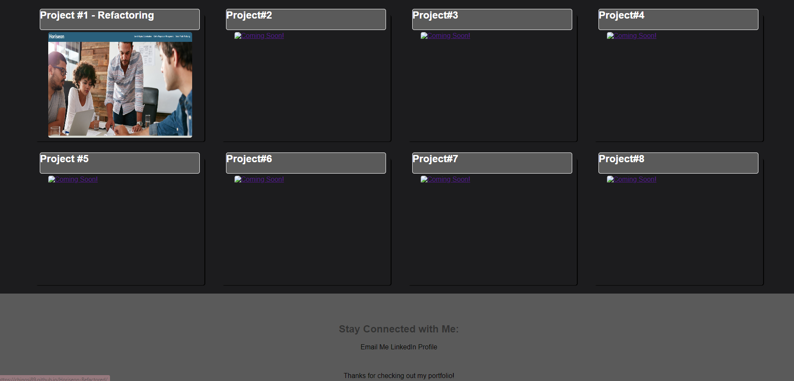

# Raphael-FullStackPortfolio

## My Portfolio for my Full Stack Web Development Class
### This portfolio will be used in my upcoming journey in web development
This assignment was to test us of our knowledge of creating our very own portfolio. We are to be tested in our ability to create without a starter code
### Acceptance Criteria is as follows: 
* To present who the portfolio belongs to with a photo or an avatar along with links about them, their work, and contact page
* the Navigation bar must scroll to the corresponding selection
* UI must scroll to a section with images of the developer's application (if in the case that the developer does not have any, an image or text must be in place)
* the image linked must go to the deployed application
* lastly, a reponsive layout must adapt to various screens and devices on the viewport

## Steps taken
Since this is our first portfolio, I looked into websites that piqued my interest and drew ideas from it. 
Since the expectation level for how creative my website will be was not stated, I created a website with a minimalist idea in mind. 

When my website is opened, the first page is this: 


Following the Acceptance criteria, i created a navigation bar that has links to portions of my application
* Projects 
* Contact Page - at the bottom of the page
* About me

When the above links are clicked, the UI will scroll to the following sections



### Project#1 
When this application is clicked, it will go to my first Assignment in week 1 of our bootcamp


### Responsive Layout
* Layout is responsive when clicked on a smaller screen with the projects placed on a flexbox
* Also realized my biggest mistake when creating media queries:
 ```
 @media screen and (min-width = 992px)
 ```
 - I realized that my changes weren't being done because of the = sign, so when I changed it to a : , all of my changes were starting to show

## Smaller Screen :


## Tablet Size Screen :


# ISSUES: 
I think the biggest issues i have is in CSS, figuring out how to make the site more creative is the most difficult part. I had to go online and somewhat draw as much inspiration without copying anyone's work and still making sure I understand what I am adding to my code. When i run into new elements, I make sure I full understand them first before implementing in my site. Overall, being creative is a difficulty for me, but I was able to create a site based off the acceptance criteria. 

Also had an issues with Github where my CSS was not uploading; fixed!

Deployed site is as follows: https://chinosj89.github.io/Raphael-FullStackPortfolio/